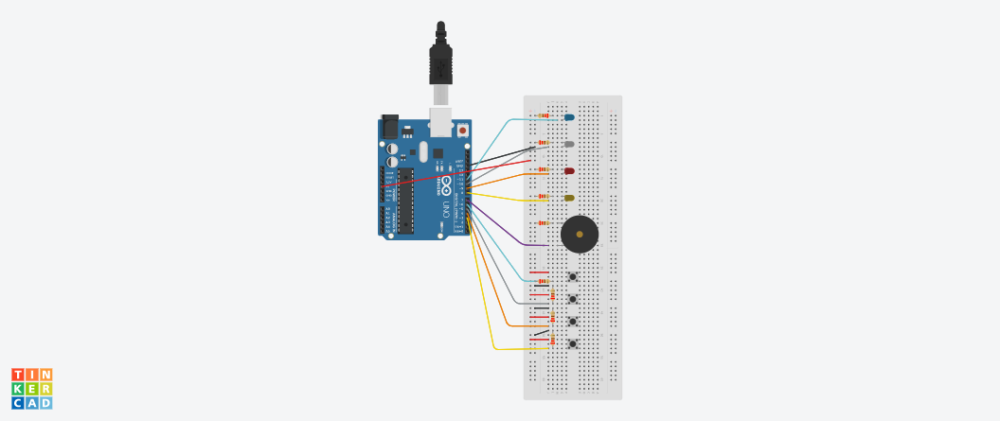

# JOGO DA MEMÓRIA - GENIUS
   ### Membros: Arhtur Oliveira Purcino, klarine Mendonça Silva, Pedro Henrique Sena Lima
   Nesse projeto desenvolvemos o jogo Genius, jogo de grande sucesso na década de 80. Consiste em um jogo da memória, no qual o jogador deve observar a sequencia    de leds piscando e repeti-la sem erros. 

## Descrição do projeto:
### 1) Componentes:
   Para a realização desse projeto utilizamos os seguintes componentes:
   - 1 Arduino Uno;
   - 4 leds de cores diferentes;
   - 4 push buttons;
   - 1 buzzer;
   - 9 resistores de 220 e 330 ohms;
   - 19 jumpers;
   - 1 Protoboard;
### 2) Softwares utilizados:
   - Arduino IDE;
   - Thinkercad;
### 3) Montagem do circuito [Simulação](https://www.tinkercad.com/things/8TiDhaiXTgY-stunning-borwo/editel?sharecode=ec7bfpsGE1sXplnLPmfAaP4-AOo3FD9d2W1bEdCW9Pw)
   Conecte os componentes conforme a firgura abaixo. Os Leds foram ligados nas portas 11,10,9 e 8 e os botões nas portas 6,5,4 e 3. Verifique cuidadosamente os        cabos de ligação antes de ligar seu Arduino. Lembre-se que o Arduino deve estar totalmente desconectado da força enquanto você monta o circuito.
   
  
### 4) Código:
   Faça o download e abra o arquivo GENIOS.ino na IDE do Arduino.
   
### 5) Como o projeto deve funcionar:
   1. Ao executar o programa, todos os leds acenderão e é dado um sinal sonoro.
   2.  Aleatoriamente, acenderá o primeiro led entre os 4 leds do jogo. O programa irá aguardar que o jogador clique no botão correspondente.
      2.1. Cada led aceso tem um som correspondente.
   3. Se o jogador acertar o botão, repete-se a sequência com o acréscimo aleatório do segundo led.
   4. Se o jogador errar, acenderá um sinal sonoro indicando o fim do jogo. Apoś isso uma nova partida se inicia.
   5. Ganha o jogador que acertar mais jogadas, ou seja, memorizar a maior sequência de sons.

#### :purple_heart: Caso queira ver o projeto montado e em execução basta clicar [aqui](https://drive.google.com/file/d/1h1jyK07l_1BTIVw9rjNBObkdOAVOMg_4/view)
#### :purple_heart: Caso queira ter acesso ao repositório do projeto no GitHub basta clicar [aqui](https://github.com/phslima/PIC_PROJETO)

  

  
  

